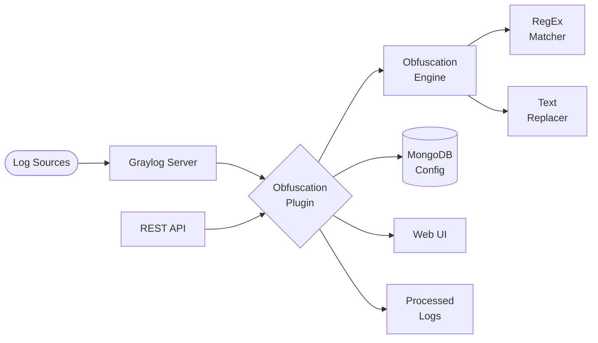

# Graylog Obfuscation Plugin

A Graylog plugin for automatic analysis and obfuscation of sensitive data in log messages using configurable regular expressions.

[](https://github.com/Netcracker/qubership-graylog-obfuscation-plugin/releases)
[](https://github.com/Netcracker/qubership-graylog-obfuscation-plugin/tree/main/docs)
[](https://github.com/Netcracker/qubership-graylog-obfuscation-plugin/actions/workflows/super-linter.yaml)

<!-- toc -->

## Features

- **Automatic sensitive data detection** using configurable regular expressions
- **Flexible obfuscation strategies** with pluggable text replacers (e.g., static star replacer)
- **Stream-based filtering** - apply obfuscation to specific Graylog streams
- **Field-level granularity** - target specific message fields for obfuscation
- **White-listing support** - exclude certain patterns from obfuscation
- **REST API configuration** - manage obfuscation rules via HTTP endpoints
- **MongoDB integration** - persistent configuration storage
- **Web interface** - React-based configuration management UI
- **Real-time processing** - integrates with Graylog's message pipeline

## Requirements

### Runtime Requirements
- **Graylog Server**: Version 3.3.0 or higher
- **Java**: OpenJDK 8 or higher
- **MongoDB**: For configuration storage

### Development Requirements
- **Java**: OpenJDK 8 or higher
- **Maven**: 3.6.0 or higher
- **Node.js**: 12.16.1 or higher
- **Yarn**: 1.22.0 or higher
- **Graylog Sources**: Required for building (see development guide)

## Installation

1. **Download the plugin JAR** from the [releases page](https://github.com/Netcracker/qubership-graylog-obfuscation-plugin/releases)

2. **Copy to Graylog plugins directory**:
   ```bash
   sudo cp graylog-obfuscation-plugin-*.jar /var/lib/graylog/plugins/
   ```

3. **Set proper permissions**:
   ```bash
   sudo chown graylog:graylog /var/lib/graylog/plugins/graylog-obfuscation-plugin-*.jar
   ```

4. **Restart Graylog server**:
   ```bash
   sudo systemctl restart graylog-server
   ```

5. **Verify installation** by checking the Graylog web interface under System > Plugins

## Usage

### Basic Configuration

1. **Access the plugin configuration** via Graylog web interface or REST API
2. **Enable obfuscation** by setting `is-obfuscation-enabled: true`
3. **Configure streams** to specify which log streams to process
4. **Define field names** to target specific message fields
5. **Add sensitive data patterns** using regular expressions

### Example Configuration

```json
{
  "is-obfuscation-enabled": true,
  "text-replacer": "Static Star Replacer",
  "stream-titles": ["security-logs", "application-logs"],
  "field-names": ["message", "user_data"],
  "sensitive-regular-expressions": [
    {
      "id": 1,
      "name": "Credit Card",
      "pattern": "\\b\\d{4}[\\s-]?\\d{4}[\\s-]?\\d{4}[\\s-]?\\d{4}\\b",
      "importance": 1
    }
  ],
  "white-regular-expressions": [
    {
      "id": 1,
      "name": "Test Credit Card",
      "pattern": "4111-1111-1111-1111"
    }
  ]
}
```

## Configuration

The plugin can be configured through:

### REST API Endpoints

- **GET** `/api/plugins/com.netcracker.graylog2.plugin/obfuscation/configuration` - Get current configuration
- **POST** `/api/plugins/com.netcracker.graylog2.plugin/obfuscation/configuration` - Update configuration
- **PUT** `/api/plugins/com.netcracker.graylog2.plugin/obfuscation/configuration/sync` - Sync with default
- **PUT** `/api/plugins/com.netcracker.graylog2.plugin/obfuscation/configuration/reset` - Reset to default
- **POST** `/api/plugins/com.netcracker.graylog2.plugin/obfuscation` - Test obfuscation

### Configuration Parameters

- `is-obfuscation-enabled`: Enable/disable obfuscation
- `text-replacer`: Replacement strategy (currently "Static Star Replacer")
- `stream-titles`: Array of stream names to process
- `field-names`: Array of message field names to obfuscate
- `sensitive-regular-expressions`: Patterns for sensitive data detection
- `white-regular-expressions`: Patterns to exclude from obfuscation

For detailed configuration options, see the [Configuration Guide](docs/configuration_guide.md).

## API Reference

### OpenAPI Specification
Complete API documentation is available in [docs/api/openapi.yaml](docs/api/openapi.yaml).

### Postman Collection
Import the [Postman collection](docs/postman/Graylog-Obfuscation-Plugin.postman_collection.json) for easy API testing.

### Documentation
- [Installation Guide](docs/installation.md)
- [Configuration Guide](docs/configuration_guide.md)
- [Development Guide](docs/development.md)
- [Sensitive Data Analysis](docs/sensitive-data-analysis.md)

## Architecture

### System Overview



The plugin integrates with Graylog's message processing pipeline through the MessageProcessor interface. It consists of two main components:

1. **Obfuscation Engine** - Core logic for pattern matching and text replacement
2. **Graylog Integration** - Plugin interface, REST API, and web UI for configuration management

Configuration is stored in MongoDB and can be managed through either the web interface or REST API endpoints.

## Testing

### Running Tests

```bash
# Run all tests
mvn test

# Run with coverage
mvn test jacoco:report

# Run specific test class
mvn test -Dtest=ObfuscationEngineTest
```

### Development Linting

Before committing, run the Super Linter locally:

```bash
docker run \
  -e RUN_LOCAL=true \
  -e DEFAULT_BRANCH=$(git rev-parse --abbrev-ref HEAD) \
  --env-file .github/super-linter.env \
  -v ${PWD}:/tmp/lint \
  --rm \
  ghcr.io/super-linter/super-linter:slim-$(sed -nE 's#.*uses:\s+super-linter/super-linter/slim@([^\s]+).*#\1#p' .github/workflows/super-linter.yaml)
```

For detailed development setup, see the [Development Guide](docs/development.md).

## Contributing

1. Fork the repository
2. Create a feature branch: `git checkout -b feature/amazing-feature`
3. Make your changes following the coding standards
4. Run tests and linting: `mvn test && docker run ...` (see Testing section)
5. Commit your changes: `git commit -m 'Add amazing feature'`
6. Push to the branch: `git push origin feature/amazing-feature`
7. Open a Pull Request

Please read [CONTRIBUTING.md](CONTRIBUTING.md) for details on our code of conduct and the process for submitting pull requests.

## License

This project is licensed under the Apache License 2.0 - see the [LICENSE](LICENSE) file for details.
